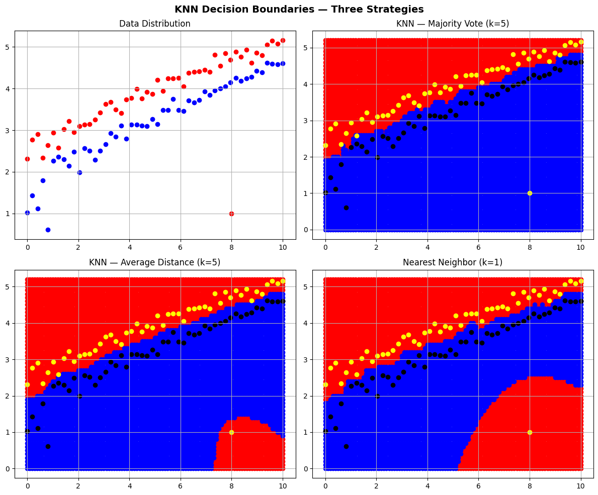

# K-Nearest Neighbors (KNN) — From Scratch

A clean NumPy implementation of the KNN classification algorithm with **three different decision strategies**, visualised through their decision boundaries on a synthetic 2-class dataset.

---

## What This Project Does

Given two classes of points (Red and Blue) distributed along noisy square-root curves, the notebook classifies every point in a dense grid using three KNN strategies and plots the resulting decision boundaries side by side.


| Strategy                | k | Rule                                                             |
|-------------------------|---|------------------------------------------------------------------|
| Nearest Neighbor        | 1 | Assign the class of the single closest point                     |
| KNN Majority Vote       | 5 | Majority class among the 5 nearest neighbors                     |
| KNN Average Distance    | 5 | Assign the class whose 5 nearest neighbors are on average closer |
---

## Project Structure

```
.
├── KNN_from_scratch.ipynb   # Main notebook
└── README.md
```

---

## Requirements

```bash
pip install numpy matplotlib
```

No scikit-learn or any ML library is used — everything is implemented from scratch with NumPy.

---

## How to Run

```bash
git clone https://github.com/<your-username>/<your-repo>.git
cd <your-repo>
jupyter notebook KNN_from_scratch.ipynb
```

Run all cells top to bottom. The final cell produces a 2×2 comparison plot.

---

## Results



The notebook generates a 2×2 figure comparing:

- Raw data distribution
- Decision boundary for KNN Majority Vote (k=5)
- Decision boundary for KNN Average Distance (k=5)
- Decision boundary for Nearest Neighbor (k=1)

Original training points are overlaid in yellow (Red class) and black (Blue class) so you can see how each strategy handles the boundary region and the outlier point.

---

## Key Concepts

- **Euclidean distance** computed with NumPy vectorisation (no loops over points)
- **Decision boundary visualisation** by classifying a dense query grid
- **Effect of k** — compare how k=1 creates jagged boundaries while k=5 smooths them
- **Outlier sensitivity** — an intentional outlier Red point at `(8, 1)` tests boundary robustness

---

## Author

Built as a learning exercise to understand KNN internals before using library implementations.
